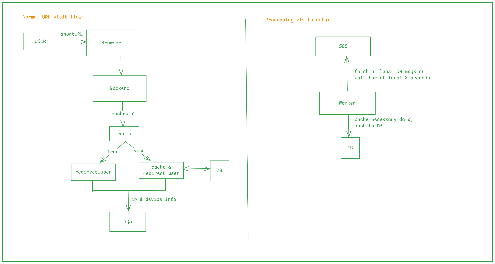

# URL Shortener API

## [Postman Documentation](https://documenter.getpostman.com/view/43899618/2sB3QJNqYz)


#### The server is hosted at url `https://shorturl.0xbuilder.in`,  visit `https://shorturl.0xbuilder.in/api/health` for health check.

---

## 🛠 Setup

```bash
git clone git@github.com:vikas-viki/url-shortener.git
cd url-shortener
npm install

# Add the environment variables defined as per `.env.example`
```

**`normal`**
```bash
# To start the main server
npm run dev

# To start the SQS poller
npm run start:worker
```

**`using docker compose`**

```bash
docker compose up --build
```

Visit `http://localhost:5000/api/health` to check if the server is running.

---

## 📘 Project Overview

This is a **URL shortening** project where a user can authenticate using Google OAuth and create short URLs with an alias of their choice.  
It also provides endpoints for **analytics**, giving insights such as:

- Unique visits  
- Device and OS breakdowns  
- Country-wise statistics  
- Trends over time  

- The project uses **Google OAuth2** for authentication and authorization.
- envs are handled via gpg encryption-decryption mechanism & git hooks.
- Project is hosted in AWS using Github actions, Docker, ECR & EC2.
- Routing happens through nginx (reverse-proxy)
- Domain hosted using Godaddy.

---

## ✨ Features

- Google OAuth2 authentication  
- Short URL creation (limit: 60 per 5 hours)  
- Detailed analytics (alias and topic based)  
- Secure rate limiting and validation mechanisms  

---

## 🧠 Challenges

One major challenge was efficiently processing URL visits at scale - each URL can receive millions of hits.  
Making a database call for every visit would be inefficient, so the architecture leverages **AWS SQS** for decoupled event processing and a **custom batching mechanism** for optimized DB writes.

---

## 🚀 Future Improvements

- Separate dedicated redirection server (scalable independently)  
- Extended controls: deletion, expiration, and management of short URLs  
- Support for custom domains  
- Horizontal scaling using a load balancer and multiple stateless instances  

---

## 🏗 Architecture
- Authentication uses `google-auth-library` & `googleapis` npm package to create google auth client, creation of auth urls and fetching user information.
- Protected endpoints like `/urls/...` and `/analytics/...` are authenticated using `authorization` header in each request.
- We use a seperate worker (file `src/utils/pollSQS.ts`) to handle sqs messages which are pushed to sqs on each short url visit, which is used for analytics.



---

## 📡 API Overview

The API is built using **Node.js**, **Express**, **PostgreSQL**, and **Redis**, along with libraries like:

- **Prisma** – ORM for database operations  
- **Zod** – Schema validation  
- **Rate-limiter-flexible** – Short URL creation rate limiting  
- **Helmet** – Security headers  
- **AWS SDK** – Integration with SQS  
- **Nanoid** – Unique alias generation  
- **UA-Parser-JS** – Device and OS detection  

The backend is deployed via **AWS ECS**, with Docker images stored in **AWS ECR**, and CI/CD handled through **GitHub Actions**.

**Base URL:** `https://shorturl.0xbuilder.in`
